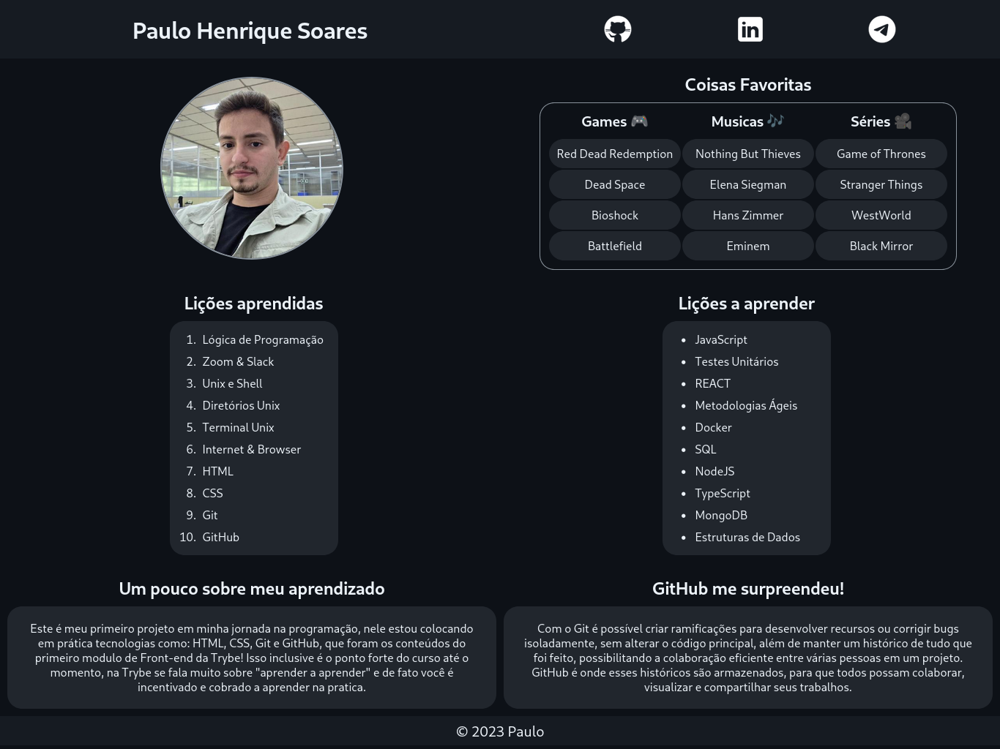

# Project Lessons Learned

## About

This is my first project during my journey as a programmer!

In this project, I put into practice what I've learned about HTML, CSS, Git, and GitHub, from creating HTML tags and using good page semantics to styling with CSS. Additionally, I created this repository, made commits, and pushed changes, going through the basic steps of version control with Git and GitHub!

## Link

[lessons-learned.vercel](https://lessons-learned-paulo.vercel.app/)

---
